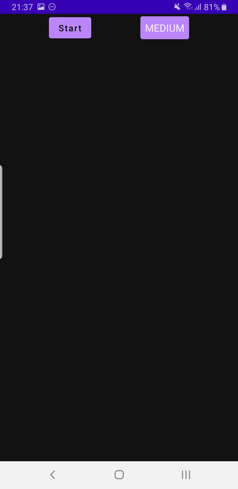
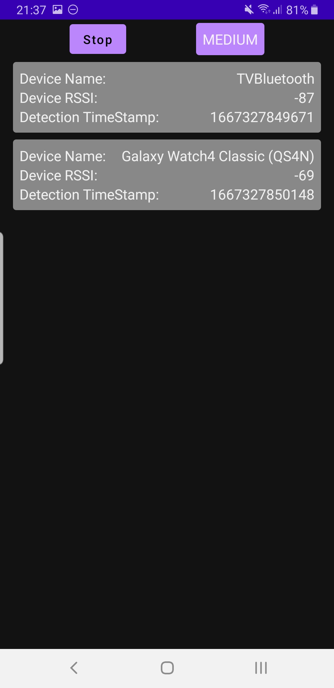

# ESRI Android Assignment - Enes Varol

# 📍 Bluetooth Library - Android Application

    

An android assignment project written with Jetpack Compose, Coroutines, ViewModel, Flow, Hilt and based on MVVM by using Android Bluetooth services.

## ℹ Introduction

It is a demonstration application about Bluetooth services library. Application get devices' information(Name,RSSI,Info recieve Timestamp) from Bluetooth services library, then shows them on simple list. Start/Stop button for device search(List gets cleared if you stop searching). Drop down menu with 3 scan rate option (Low,Medium,High) to choose scan time interval.

## What You Will Need

**Hardware Requirements**
- A computer that can run Android Studio.
- An Android phone with bluetooth support for debugging.

**Software Requirements**
- Android SDK package
- Android Studio 4.X

## 🛠 Features

- Get location&bluetooth opening permissions
- Get device list
- Set scan rate

## 📱 Screenshots

  
  
  

  
  

## 📲 Download

Go to the [Releases](https://github.com/vrolnes/ESRIChallenge/tree/main/release) to download the latest APK.

## 🏗 Tech Stack

Implemented and Tested on Samsung Galaxy Note 8

### Architecture

- MVVM Clean & Single-Based Architecture
- Library imp. and integration

### Libraries

- [Coroutines](https://github.com/Kotlin/kotlinx.coroutines) - Perform asynchronous operations

- [Hilt](https://dagger.dev/hilt/) - for dependency injection

- Jetpack Libraries
    - [Compose](https://developer.android.com/jetpack/compose/documentation) - Build modern declarative Android UI
    - [Lifecycle](https://developer.android.com/jetpack/compose/lifecycle) - Observe lifecycle state changes
    - [ViewModel](https://developer.android.com/topic/libraries/architecture/viewmodel) - Store UI related data
